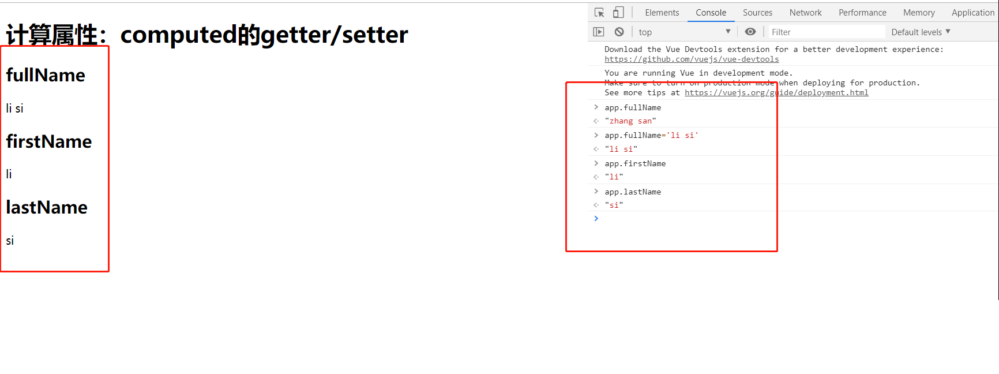

# vue 实例的其他属性

## 1. 计算属性 computed 

## 1.1 计算属性的基本使用

方法调用需要使用()，而计算属性不用，方法取名字一般是动词见名知义，而计算属性是属性是名词，但这只是基本使用。

- 使用Mastache语法拼接`<h2>{{firstName+ " " +lastName}}</h2>`

- 使用方法methods`<h2>{{getFullName()}}</h2>`

- 使用计算属性computed`<h2>{{fullName}}</h2>`

  ### 示例

  ```vue
  <!DOCTYPE html>
  <html lang="en">
  <head>
    <meta charset="UTF-8">
    <meta name="viewport" content="width=device-width, initial-scale=1.0">
    <meta http-equiv="X-UA-Compatible" content="ie=edge">
    <title>计算属性的基本使用</title>
  </head>
  <body>
    <div id="app">
  	<!-- Mastache语法 -->
  	<h2>{{firstName+ " " + lastName}}</h2>
  	<!-- 方法 -->
  	<h2>{{getFullName()}}</h2>
  	<!-- 计算属性 -->
  	<h2>{{fullName}}</h2>
    </div>
    <script src="https://cdn.jsdelivr.net/npm/vue@2.6.10/dist/vue.js"></script>
    <script>
  	const app = new Vue({
  	  el:"#app",
  	  data:{
  		firstName:"skt t1",
  		lastName:"faker"
  	  },
  	  computed: {
  		fullName:function(){
  		  return this.firstName + " " + this.lastName
  		}
  	  },
  	  methods: {
  		getFullName(){
  		  return this.firstName + " " + this.lastName
  		}
  	  },
  	})
    </script>
  </body>
  </html>
  
  ```

### 1.2 计算属性的复杂使用

```vue
<!DOCTYPE html>
<html lang="en">
<head>
  <meta charset="UTF-8">
  <meta name="viewport" content="width=device-width, initial-scale=1.0">
  <meta http-equiv="X-UA-Compatible" content="ie=edge">
  <title>计算属性的复杂使用</title>
</head>
<body>
  <div id="app">
	<h2>总价格：{{totalPrice}}</h2>
  </div>
  <script src="https://cdn.jsdelivr.net/npm/vue@2.6.10/dist/vue.js"></script>
  <script>
	const app = new Vue({
	  el:"#app",
	  data:{
		books:[
		  {id:110,name:"JavaScript从入门到入土",price:119},
		  {id:111,name:"Java从入门到放弃",price:80},
		  {id:112,name:"编码艺术",price:99},
		  {id:113,name:"代码大全",price:150},
		]
	  },
	  computed: {
		totalPrice(){
		  let result= 0;
		  for (let i = 0; i < this.books.length; i++) {
			result += this.books[i].price;
		  }
		  return result
		}
	  }
	})
  </script>
</body>
</html>

```

### 1.3 计算属性的setter和getter

计算属性默认只有 `getter` ，不过在需要时你也可以提供一个 `setter `

```vue
<!DOCTYPE html>
<html lang="en">
<head>
	<meta charset="UTF-8">
	<meta name="viewport" content="width=device-width, initial-scale=1.0">
	<meta http-equiv="X-UA-Compatible" content="ie=edge">
	<title>Vue计算属性的getter和setter</title>
	<script src="https://cdn.jsdelivr.net/npm/vue@2.6.10/dist/vue.js"></script>
</head>
<body>
	<div id="app">
		<h1>计算属性：computed的getter/setter</h1>
		<h2>fullName</h2>
		{{fullName}}
		<h2>firstName</h2>
		{{firstName}}
		<h2>lastName</h2>
		{{lastName}}
	</div>
	<script>
		var app = new Vue({
			el:"#app",
			data:{
			firstName:"zhang",
			lastName:"san",
			},
			computed: {
				fullName:{
					get:function(){
						return this.firstName+" "+this.lastName
					},
					set:function(value){
						var list = value.split(' ');
						this.firstName=list[0]
						this.lastName=list[1]
					}
				}
			},
		});
	</script>
</body>
</html>
```

通过 settr 修改 属性的值



### 1.4 计算计属性与方法的区别

+ 计算属性是基于它所依赖的数据进行更新，在有在相关依赖的数据发生变化了才会进行更新，而普通的方法每次都会执行
+ 计算属性是有缓存的，只要它所依赖的数据没有发生改变，后面的每一次访问计算属性中的值，都是之前缓存的结果，不会重复执行。

## 2. watch 属性的使用

### 2.1 基本使用

在vue中，使用watch来响应数据的变化。

```html
<input type="text" v-model="cityName"/>
```

```js
new Vue({
  el: '#root',
  data: {
    cityName: 'shanghai'
  },
  watch: {
    cityName(newName, oldName) {
      // ...
    }
  } 
})
```

### 2.2 immediate 和 handler

直接使用watch时有一个特点，就是当值第一次绑定的时候，不会执行监听函数，只有值发生改变才会执行。如果我们需要在最初绑定值的时候也执行函数，则就需要用到immediate属性。比如当父组件向子组件动态传值时，子组件props首次获取到父组件传来的	默认值时，也需要执行函数，此时就需要将immediate设为true。

```js
new Vue({
  el: '#root',
  data: {
    cityName: ''
  },
  watch: {
    cityName: {
    　　handler(newName, oldName) {
      　　// ...
    　　},
    　　immediate: true
    }
  } 
})
```

### 2.3 deep

当需要监听一个对象的改变时，普通的watch方法无法监听到对象内部属性的改变，只有data中的数据才能够监听到变化，此时就需要deep属性对对象进行深度监听。

```html
<input type="text" v-model="cityName.name"/>
```

```js
new Vue({
  el: '#root',
  data: {
    cityName: {id: 1, name: 'shanghai'}
  },
  watch: {
    cityName: {
      handler(newName, oldName) {
      // ...
    },
    deep: true,
    immediate: true
    }
  } 
})
```

设置deep: true 则可以监听到cityName.name的变化，此时会给cityName的所有属性都加上这个监听器，当对象属性较多时，每个属性值的变化都会执行handler。如果只需要监听对象中的一个属性值，则可以做以下优化：使用字符串的形式监听对象属性：

```js
watch: {
    'cityName.name': {
      handler(newName, oldName) {
      // ...
      },
      deep: true,
      immediate: true
    }
  }
```

## 3. 过滤器 filter

### 3.1 什么是过滤器

过滤器是对即将显示的数据做进一步的筛选处理，然后进行显示，值得注意的是过滤器并没有改变原来的数据，只是在原数据的基础上产生新的数据。

### 3.2 过滤器使用的地方

- v-bind
- 双括号表达式

```html
<div>{{数据属性名称 | 过滤器名称}}</div>
<div>{{数据属性名称 | 过滤器名称(参数值)}}</div>
<!-- 在 `v-bind` 中 -->
<div v-bind:id="数据属性名称 | 过滤器名称"></div>
<div v-bind:id="数据属性名称 | 过滤器名称(参数值)"></div>
```

### 3.3 全局过滤器

```html
<div id="app">
    <span>{{msg|capitalize}}</span>//data中声明msg:'hello'
</div>
```

```js
//全局过滤器，将信息转成大写
  Vue.filter('capitalize', function (value) {
    //value左边那个属性值
    return value.toUpperCase()
  })
```

### 3.4 局部过滤器

```html
<div id="app">
    <!--过滤器接收多个参数-->
    <span>{{value1|multiple(value2,value3)}}</span>
</div>
```

```js
<script>
  var vm = new Vue(
    {
      el: '#app',
      data: {
        msg: 'hello',
        value1:10,
        value2:20,
        value3:30
      },
    //局部过滤器
      filters: {
        'multiple': function (value1, value2, value3) {
          return value1*value2*value3
        }
      }
    }
  )
</script>
```


