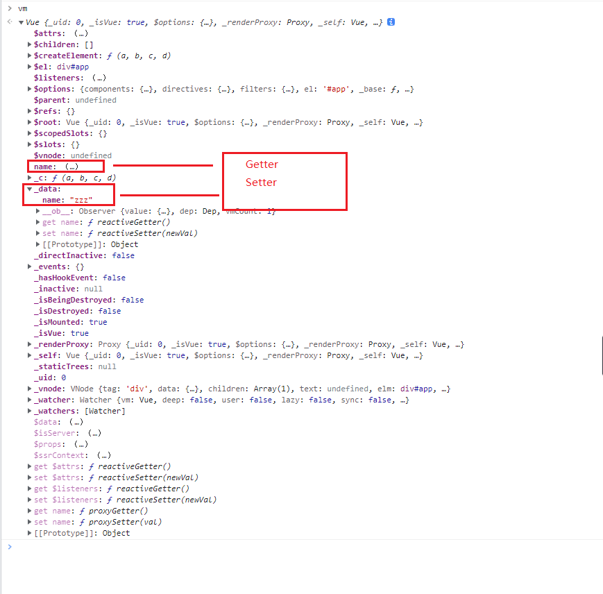
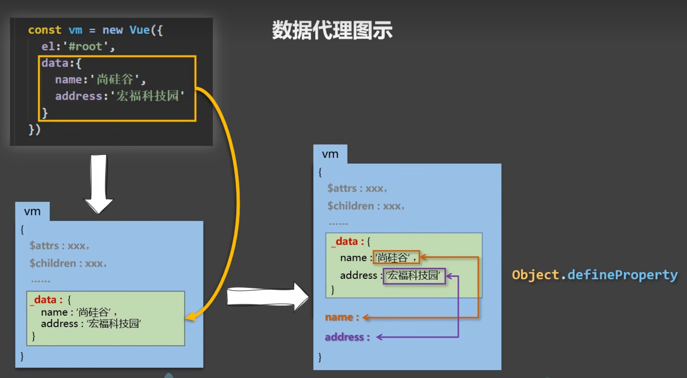

# 数据代理


## `Object.defineProperty`的使用

### 介绍

`Object.defineProperty` ，顾名思义，为对象定义属性。

对象是由多个名/值对组成的无序的集合。对象中每个属性对应任意类型的值。
定义对象可以使用构造函数或字面量的形式：

```javascript
var obj = new Object;  //obj = {}
obj.name = "张三";  //添加描述
obj.say = function(){};  //添加行为
```

除了以上方式，还可以使用 `Object.defineProperty` 方法定义新属性或修改原有的属性。

```javascript
Object.defineProperty(obj, prop, descriptor)
```

参数说明：

- obj：必需。目标对象 
- prop：必需。需定义或修改的属性的名字
- descriptor：必需。目标属性所拥有的特性

返回值：

- 被传递给函数的对象。


### 属性描述符

对象里目前存在的属性描述符有两种主要形式：**数据描述符**和**存取描述符**。**数据描述符**是一个拥有可写或不可写值的属性。**存取描述符**是由一对 getter-setter 函数功能来描述的属性。描述符必须是两种形式之一；不能同时是两者，即：

- value 与 get 作用相同，只能用同时一个。
- writable和set作用相同，只能用同时一个。

value：该属性对应的值。可以是任何有效的 JavaScript 值（数值，对象，函数等）。默认为 undefined。

```javascript
var a = {name:"leirp",sex: 0}
Object.defineProperty(a,"age",{value: 18})
console.log(a.age)   // 18
```

writable：当且仅当该属性的 writable 为 true 时，该属性才能被赋值运算符改变。默认为 false。

```javascript
var a = {name:"leirp"}
Object.defineProperty(a,"age",{
	value: 18,
})

Object.defineProperty(a,"sex",{
    value: 0,
    writable:true
})
a.age = 19
a.sex = 1
console.log(a.age)  // 18
console.log(a.sex) // 1

```

configurable： 当且仅当该属性的 configurable 为 true 时，该属性描述符才能够被改变且从对应的对象上可被删除。默认为 false。

```javascript
var a = {name:"leirp"}
Object.defineProperty(a,"age",{
	value: 18,
})

Object.defineProperty(a,"sex",{
    value: 0,
    configurable:true
})
delete a.age   
console.log(a.age) // 18
delete a.sex
console.log(a.sex)  // undefined
```

enumerable： 当且仅当该属性的 enumerable 为 true 时，该属性才能够出现在对象的枚举属性中。默认为 false。

```javascript
var a = {name:"leirp"}
Object.defineProperty(a,"age",{
	value: 18,
})
Object.defineProperty(a,"sex",{
    value: 0,
    enumerable:true
})
for (key in a) {
	console.log(key)
}
// 打印   name  sex
```

Setters 和 Getters

- get： 一个给属性提供 getter 的方法，如果没有 getter 则为 undefined。该方法返回值被用作属性值，在读取被代理的值时被调用。默认为 undefined。
- set：一个给属性提供 setter 的方法，如果没有 setter 则为 undefined。该方法将接受唯一参数，并将该参数的新值分配给该属性。当修改被代理的值的时候被调用。默认为 undefined

```javascript
let number = 18
const parson = {name: "leirp",sex: 0}

Object.defineProperty(parson,"age",{
    get: function() {
    	return number
	},
	set: funcation(value) {
        // value: 被设置的新值
        number = value // 将新值赋值给value
    },
	configurable： true,
    enumerable: true
})

console.log(parson.age)  // 18
number = 20
console.log(parson.age) // 20
parson.age = 30
console.log(number)  // 30

```

### 数据代理

通过一个对象代理对另外一个对象中属性的操作（读和写）叫做数据代理

```javascript
const obj1 = {x: 100}
const obj2 = {y: 200}
Object.defineProperty(obj2,"x",{
	get(){
		return obj1.x
	},
	set(value){
		obj1.x = value
	}
})
console.log(obj1.x,obj2.x) // 100 100
obj1.x = 300
console.log(obj2.x)  // 300
obj2.x = 400
console.log(obj1.x) // 400

```

### vue 中的数据代理

在vue2中通过data对象中的属性来实现数据代理，实例化时，将data 赋值在vue实例的 `_data`属性中 ，然后将`_data`属性中的数据添加到vue实例中，并为每一个添加到vue实例中的属性通过`Object.defineProperty` 指定一个 getter/setter。 使之更加方便的操作data中的数据。

```html
<!DOCTYPE html>
<html lang="en">
<head>
  <meta charset="UTF-8">
  <meta name="viewport" content="width=device-width, initial-scale=1.0">
  <meta http-equiv="X-UA-Compatible" content="ie=edge">
  <script src="https://cdn.jsdelivr.net/npm/vue@2.6.10/dist/vue.js"></script>
  <title>HelloVuejs</title>
</head>
<body>
  <div id="app">
      <h2>学校：{{name}}</h2>
      <h2>学校1：{{_data.name}}</h2>
  </div>
   
  <script>
    const data = {
        name:"zzz"
    }
    const vm = new Vue({
      el:"#app",
      data
    })
  </script>
</body>
</html>
```

通过以下代码可以看到，name 的值与 _data中name的值是相互改变的


```javascript
vm.name = "清华大学"
console.log(vm._data.name) //清华大学
vm._data.name = "北京大学"
console.log(vm.name)   //北京大学
```



原理图如下：



